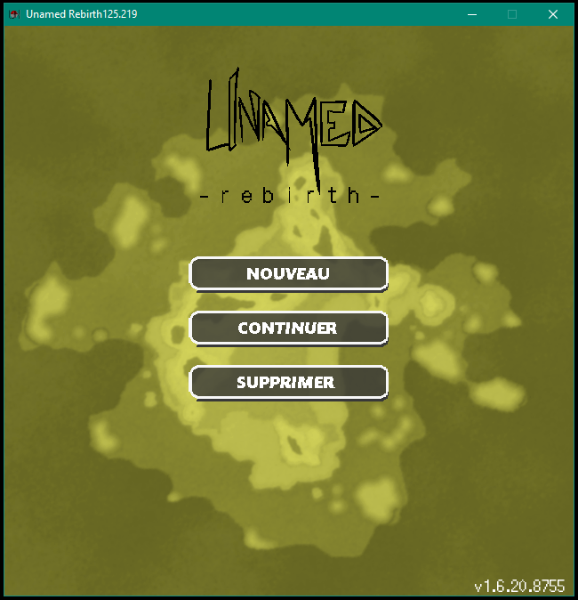
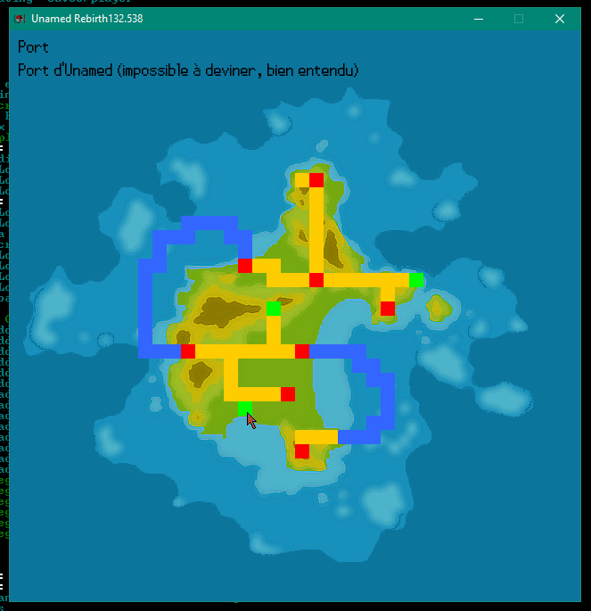

## Le jeu

Unamed Rebirth est un jeu développé en C++ (11), utilisant la SFML (2.4.2). 
Nous voulons fournir un jeu comme vous n'en avez jamais vu auparavant, mixant Pokémon, Dragon Quest et Final Fantasy. 
C'est bien entendu un jeu gratuit, et le code source de celui-ci est trouvable sous la [licence MIT](https://github.com/Loodoor/Unamed-Endive/blob/master/LICENSE).

<!-- ## Teasing du scénario -->

## Créatures

Nous avons 230 créatures exclusives dans ce jeu, toutes réalisées par [Smiley-Fakemon](http://smiley-fakemon.deviantart.com/), 
que vous pouvez trouver [ici](https://github.com/Loodoor/Unamed-Endive/tree/master/assets/creatures).

Chaque créature a un type unique, parmi ceux-ci :

* normal

* feu

* eau

* plante

* vol

* combat

* poison

* électrique

Une créature a des statistiques d'attaque et de défense, ainsi qu'un nombre de points de vie (PV) définies, et variant avec le niveau de la-dite créature.

## Système de combat

Chaque créature a un sort unique avec un type (touche tous les ennemis / touche un seul ennemi / soigne un allié / soigne tout le monde / brûle / paralyse ...) 
et des dégâts (si celui-ci peut en faire). Vous choisissez quand vous lancez un sort, ainsi que sa cible (si le type de sort vous le permet, 
le type "touche tous les ennemis" démarrant immédiatement).

Au début de votre aventure, vous pourrez avoir seulement 3 créatures en combat, en même temps. Cela veut donc dire que vous aurez au maximum 3 sorts différents !

Lorsque vous terminez un combat, la créature ayant gagné (la votre ou la créature adverse) vole `(1 / niveau de l'adversaire) * (expérience totale de son adversaire) + 5` points d'expériences.

## Images

Et ce n'est qu'un avant goût ! En effet il a bien plus que des interfaces à découvrir, l'île entière d'Unamed reste à parcourir, de même qu'il y a toutes ces créatures à capturer !

Une aventure vous attend !

## Bien plus encore est à venir

Nous avons dans nos cartons divers mécanismes et idées pour le jeu, que nous avons choisi de ne pas utiliser ou ajouter *pour le moment*, entre autre :

- un concept d'arbre de compétences par sort et par créature

- un concept de Points de Pouvoir par sort (donc cela restreint l'usage d'un sort s'il n'a plus de Points de Pouvoir)

- un mode de jeu en réseau

- et encore plein d'autres choses !

Tout cela viendra sûrement pour une V2 du projet ;)

## Contribuer

Pour que ce projet reste une grande aventure, nous avons besoin de vous !

Si vous êtes développeur et souhaitez aider dans le développement du jeu, vous pouvez forker celui-ci sur [GitHub](https://github.com/Loodoor/Unamed-Endive) 
et dès que vous avez fait vos modifications, envoyez juste une *pull request* et je la vérifierai personnellement voir même la mergerai !

Vous pouvez aussi télécharger [la dernière version](https://github.com/Loodoor/Unamed-Endive/releases) pour la tester, et si vous rencontrez un bug, 
(nous adorons les bugs), vous pouvez ouvrir une *issue*, avec de préférence toutes les étapes pour reproduire celui-ci (et aussi inclure le contenu de la console).

## Liens

- [Roadmap du projet](https://trello.com/b/JdzEnDJf/unamed-endive)

- [Twitter de Loodoor](https://twitter.com/Folaefolc)

- [Twitter du jeu](https://twitter.com/UnamedRebirth)

## Support

Si vous avez besoin d'aide avec le jeu, voici un [wiki](https://github.com/Loodoor/Unamed-Endive/wiki) avec différentes ressources sur le *scripting* (si vous voulez modifier le jeu par exemple), les différents *contrôles* ... etc.
Si vous souhaitez juste parler avec nous, n'hésitez pas à rejoindre notre [channel Discord](https://discord.gg/AWSWvgU) !

